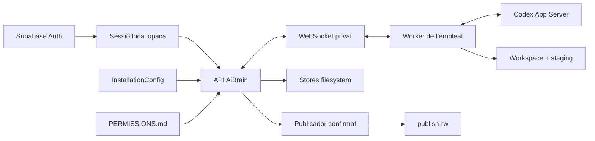

# Arquitectura Codex-native d’AiBrain

## Decisió

AiBrain és un Company Brain white-label sobre Codex App Server. Codex continua
sent el motor agentic; AiBrain controla identitat, configuració, permisos,
persistència, concurrència, publicació i experiència. Cada empresa de producció
té una instal·lació i servidor dedicats, però totes comparteixen el mateix codi.

## Capes

1. **Installation boundary**: `InstallationConfig` versionat defineix identitat,
   domini, marca i arrels absolutes sense literals de client.
2. **Identity boundary**: Supabase valida login, canvi inicial i recuperació;
   després AiBrain emet una sessió local opaca, revocable i vinculada a l’usuari.
3. **Filesystem product stores**: projectes, threads, turns, approvals,
   documents, memòria i auditoria són locals, tipats, atòmics i recuperables.
4. **Policy boundary**: `PERMISSIONS.md` es resol al servidor per turn i se
   n’auditen versió i fingerprint.
5. **Employee runtime**: cada UUID té worker calent, `CODEX_HOME`, workspace,
   staging, artifacts, credencials, browser, perfil i descàrregues independents.
6. **Private transport**: Next.js parla amb el worker per WebSocket autenticat
   sobre loopback, amb heartbeat, replay, ACK, dedupe, backoff i idempotència.
7. **Application contract**: la UI només consumeix DTOs i NDJSON d’AiBrain; no
   rep connexions App Server/CDP, paths, credencials ni IDs interns.
8. **Controlled publication**: Codex treballa en staging sobre `source-ro`; només
   el publicador server-side pot escriure a `publish-rw` després de freeze, hash,
   preview i confirmació explícita exactament una vegada.

## Aïllament

- Instal·lació i usuari provenen de configuració i sessió, mai del body.
- Els roots de cada empleat es provisionen amb permisos privats i sense
  symlinks; el sandbox físic oculta altres usuaris i `publish-rw`.
- Events, approvals i tools es correlacionen per usuari, thread, turn i item.
- Cada thread del browser té target i descàrregues propis; CDP viatja per pipes
  heretats i l’egress es resol i fixa abans d’obrir el socket.
- No hi ha Postgres de producte, RLS de producte, Redis, Kubernetes, Mem0,
  Cognee, pgvector ni OpenFGA.

## Replicabilitat i operació

Una segona empresa s’aixeca canviant configuració, secrets, branding, routes i
recursos de servidor. CPU i RAM poden ampliar-se sense canviar codi. No existeix
una quota comercial de treballadors, projectes, chats, turns o tokens; els
registries apliquen backpressure i límits de saturació tècnics.

Els contractes exactes són a `docs/UI_BACKEND_CONTRACT.md`. Les comprovacions,
resultats i gates externs són a `docs/AIBRAIN_BACKEND_PROGRESS.md` i als runbooks
d’operació. DNS, cutover, dades reals, NAS real i subscripcions requereixen una
autorització separada.
