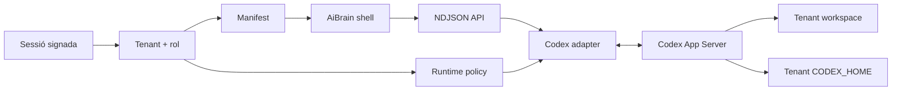

# Arquitectura Codex-native d’AiBrain

## Decisió

AiBrain és una capa de producte pròpia sobre Codex App Server. No personalitzem la UI tancada de Codex: reproduïm el seu model d’interacció útil sobre un protocol públic i mantenim tota la superfície de producte sota control nostre.

## Capes

1. **Identity boundary**: sessió, usuari, tenant i rol verificats al servidor.
2. **Manifest registry**: marca, veu, sistema visual, comportament i finestres de cada producte.
3. **Product shell**: fils, composer, activitat inline i finestres contextuals.
4. **UI contract**: esdeveniments estables de thread, text, pla, activitat, aprovació i diff.
5. **Runtime adapter**: traducció bidireccional entre NDJSON i Codex App Server.
6. **Policy boundary**: workspace, `CODEX_HOME`, sandbox, model i aprovacions derivats del tenant.
7. **Control plane**: edició owner-only d’overlays validats. El filesystem és la persistència del prototip; una base de dades serà necessària per al servei multiusuari.

## Aïllament

- La sessió no accepta un `tenantId` del navegador; el deriva de la identitat allowlist.
- Cada API torna a verificar sessió i rol.
- `localStorage` utilitza claus amb el tenant com a namespace.
- Els threads es persisteixen al navegador com a tokens HMAC opacs. El servidor valida tenant i caducitat abans de recuperar l’ID cru.
- El registre d’aprovacions guarda el tenant i rebutja decisions creuades.
- Workspace i `CODEX_HOME` es deriven d’arrels administrades, mai d’una ruta enviada pel client.

## Replicabilitat

El tenant canvia configuració, no codi. Un nou producte necessita una definició de tenant, un manifest i un workspace; comparteix auth adapter, contracte UI i runtime. Les finestres `chat`, `inspector` i `runtime` formen el primer registre extensible i es poden activar per manifest.

## Límit d’auth

Hi ha dos adaptadors explícits. `demo` és una allowlist signada, només local i desactivada en producció. `supabase` utilitza cookies SSR, `getClaims()` i memberships Postgres; si falta qualsevol valor públic, falla tancat. Els manifests passen a versions append-only i les polítiques RLS repeteixen l’aïllament de l’aplicació dins la base de dades. La secret key només existeix a la ruta owner-only d’invitacions.

## Següent tall

1. Provisionar Supabase hosted, aplicar la migració i validar auth/RLS/email live.
2. Afegir lectura d’historial i rollback owner-only dels manifests ja versionats.
3. Provisionar volums/credencials Codex per tenant en un host persistent.
4. Executar i validar la imatge Docker sobre aquell host.
